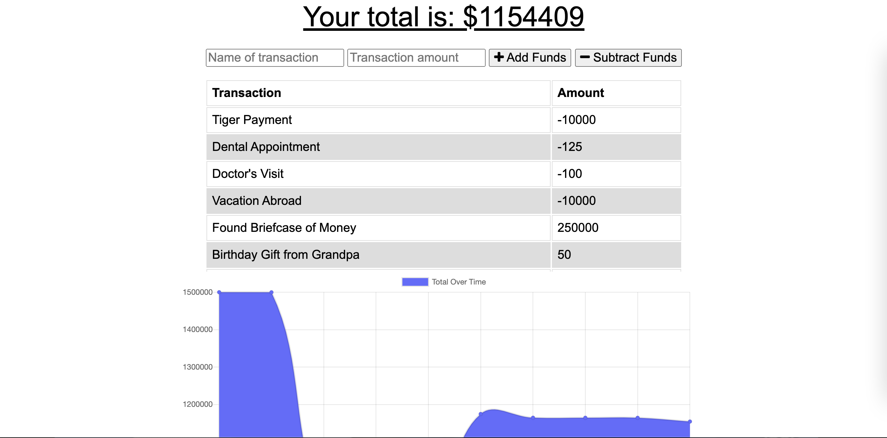

# Budget_Tracker

  ## Description
  The user will be able to add expenses and deposits to their budget with or without a connection. When entering transactions offline, they should populate the total when brought back online.
  ​
  ## Table of Contents  ​
  * [Installation](#installation)
  ​
  * [Usage](#usage)
  ​
  * [Tests](#tests)
  ​
  * [Questions](#questions)
  ​
  ## Installation
  ​
  To install necessary dependencies, run the following command:
  ​
  npm install

  ## Usage
  ​
  Use https://github.com/jpls218/Budget_Tracker to pull down this repository
    
  ## Tests
  ​
  To run tests, run the following command:​

  node server.js

  ## Questions
  ​
  If you have any questions about the repo, open an issue or contact me directly at lakjflsf. You can find more of my work at my github (https://github.com/jpls218/).

  ## Screenshots

  